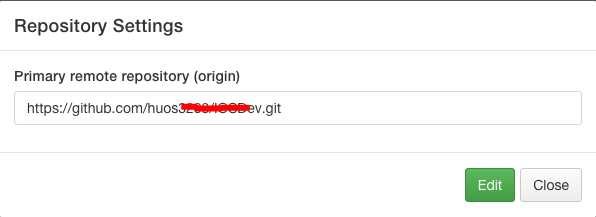

####将gitbook添加到github库中
* 使用gitbook新建New book，即在~/GitBook/Library/Import/yourbookName/下，创建了git库
* 菜单：Book -> Repository setting... -> 
* 使用SourceTree版本工具，添加本地的yourbookName版本库，来协助gitbook管理版本。

####协助Octopress
* 必须在yourBlog目录下，执行rake newe_post['']创建.MarkDown文件。
* 将第一步新建的文件，通过Gitbook的Files tree 树形栏，导入yourbookname版本库中。
* 在gitbook的Table of Contents中新建章节，命名为第一步创建时的文件名。
* 编辑yourbookName 版本库中的SUMMARY.md，将文件与目录关联起来，并保存SUMMARY.md。
* 点击目录节点名，即可在编辑框内，对该md文件编辑。

####如何将gitbook编辑的md文件内容同步到Octopress中
* 方法一：拷贝gitbook编辑的md文件，覆盖到octpress的_post目录下。
* 方法二：通过github，公用一个版本库，来管理同步。

<font color=red>更新：</font>gitbook 4.2.2之后，默认将rake new_post生成的文件目录导入到~/gitbook目录中，至此，以上方法作废了。

使用GitBook（**版本限于4.0之前的版本**） 来编写Octopress博客的步骤：  
1. ```cd ~/MyBlog```  
2. **`rake new_post['文章名']`**或 **`rake new_page['404']`**新建md文档.  
3. **`mv *.markdown *.md`** mv命令修改后缀为md，便于gitbook在Preview website识别该文档。  
4. 配置SUMMARY.md 关联 gitbook，通过目录访问Octopress文档。  
5. 打开gitbook客户端，对新建的文档进行编写即可。

